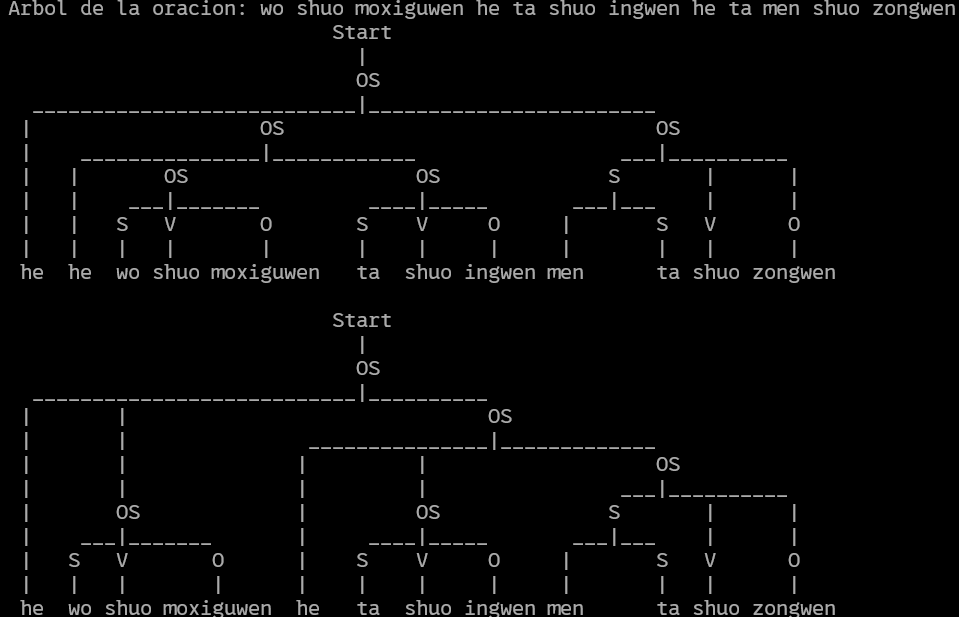
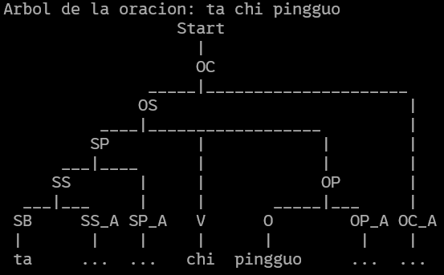
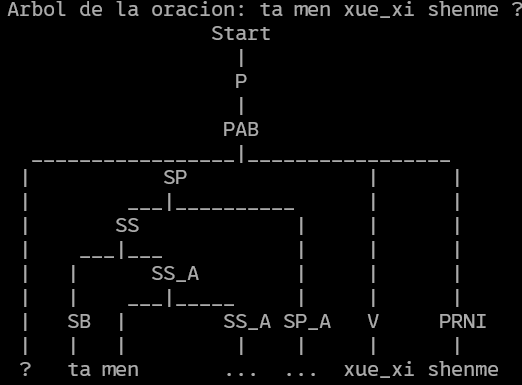
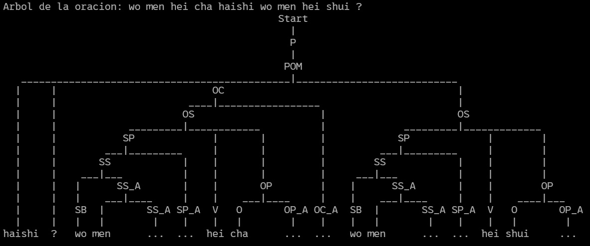

# Evidencia Generación y Limpieza de Gramática
Joel Guadalupe García Guzmán - A01713785

## Descripción
El lenguaje que yo escogí es el Chino simplificado. Escogeré este lenguaje pues lo vimos en la preparatoria y tengo un libro (Jiameng, 2004) llamado Hànyǔ el cual contiene muchas gramáticas, las cuales voy a usar para generar mi árbol de gramática

## Estructura del lenguaje
La gramática del chino simplificado se basa en la estructura sujeto-verbo-objeto, también voy a modelar la estructura de preguntas abiertas y las preguntas de si/no.
Algunas características del lenguaje es que los verbos no se conjugan en diferentes tiempos, sino que puedes agregar algunas partículas para denotar que una acción se está realizando en el presente, en el pasado o en el futuro, pero el verbo se mantiene igual.

También mencionar que para poder modelar el sistema y que no cause problemas con ninguna herramienta que pueda usar, voy a representar los caractéres con su escritura en 'pinyin', que es 
"El sistema de transcripción fonética del chino mandarín mediante el alfabeto latino" (Jiameng, 2004).
Este sistema usa acentos (ō, ó, ǒ, ò) para denotar la pronunciación y los diferentes tonos de las palabras, sin embargo, van a ser omitidos por la misma razón que pueden causar problemas con las diversas herramientas que pueda usar.

## Palabras que useré
Las palabras que usaré son las siguientes:

### Sujetos 
* `wo:` Yo
* `ta:` El/ella
* `men:` *Partícula que si la agregas a algún sujeto lo vuelves plural, por ejemplo 'women' se vuelve nosotros y 'tamen' se vuelve ellos/ellas*
Mientras que la implementación correcta sería juntar las partículas 'wo' y 'ta' con 'men' sin dejar espacio, para agregar un punto donde se genere ambiguedad y recursión a la izquierda, voy a asumir que tienes que agregar el espacio.

### Extras
* `he:` Y (and)
* `haishi:` O (or)
* `bu:` No
* `ma:` *Partícula que vuelve una oración en pregunta*

### Pronombres interrogativos
* `shenme:` ¿Qué?
* `nali:` ¿Dónde?
* `zenme:` ¿Cómo?
* `weishenme:` ¿Por qué?

### Verbos
* `shi:` Ser
* `chi:` Comer
* `xue_xi:` Estudiar
* `hei:` Beber
* `kan:` Leer / Ver / Mirar
* `ting:` Escuchar
* `shuo:` Hablar / Decir
* `xie:` Escribir
* `qu:` Ir
* `lai:` Venir
* `zuo:` Hacer
* `mai:` Comprar
* `gong_zuo:` Trabajar

### Objetos
* `fan:` Comida / Arroz
* `hanpaopao:` Hamburguesa
* `bingqilin:` Helado
* `shui:` Agua
* `cha:` Té
* `kafei:` Café
* `pijiu:` Cerveza
* `shu:` Libro
* `quianbi:` Lápiz
* `dianying:` Película
* `yinyue:` Música
* `hanzi:` Caracteres chinos
* `moxiguwen:` Idioma español
* `zongwen:` Idioma chino
* `ingwen:` Idioma inglés
* `dongxi:` Cosa / Objeto
* `mianbao:` Pan
* `pingguo:` Manzana
* `kaoshi:` Examen
* `moxiguren:` Mexicano
* `chang:` Fábrica

## Estructuras de oraciones
Las principales estructuras que voy a usar para mi lenguaje son las siguientes:

### Oraciones simples
Una oración simple lleva el formato de:

`Sujeto + verbo + objeto`

Y una oración negativa lleva el siguiente formato:

`Sujeto + 'bu' + verbo + objeto`

### Oración interrogativa 
La estructura para una oración de interrogativa de si/no es la siguiente:

`Oración simple positiva + 'ma' + '?'`

Otra estructura es la de 'Qué prefieres' la cual es:

`Oración simple + 'haishi' + oración simple + '?'`

Mientras que para las preguntas abiertas se usa la siguiente estructura:

`Sujeto + verbo + Palabra interrogativa + '?'`

## Revisión de gramática
la gramática inicial ya puede modelar a nuestro lenguaje, o al menos las palabras y oraciones que declaramos. Se vería algo así 
```
grammar = CFG.fromstring("""
    Start -> OS | P
    
    OS -> OS 'he' OS | S V O | S 'bu' V O
    
    P -> PSN | POM | PAB
    PSN -> OS 'ma' '?'
    POM -> OS 'haishi' OS '?'
    PAB -> S V PRNI '?'
    
    PRNI -> 'shenme' | 'nali' | 'zenme' | 'weishenme'
    S -> S 'he' S | S 'men' | 'wo' | 'ta'
    V -> 'shi' | 'chi' | 'xue_xi' | 'hei' | 'kan' | 'ting' | 'shuo' | 'xie' | 'qu' | 'lai' | 'zuo' | 'mai' | 'gong_zuo'
    O -> O 'he' O | 'fan' | 'hanpaopao' | 'bingqilin' | 'shui' | 'cha' | 'kafei' | 'pijiu' | 'shu' | 'quianbi' | 'dianying' | 'yinyue' | 'hanzi' | 'moxiguwen' | 'zongwen' | 'ingwen' | 'dongxi' | 'mianbao' | 'pingguo' | 'kaoshi' | 'moxiguren' | 'chang'
""")
```
Esta declaración es funcional, sin embargo tiene 2 principales problemas los cuales no nos dejarían usar un *parser* pues el lenguaje cuenta con ambiguedad y recursión a la izquierda.

Para definir la **ambiguedad** en una gramática libre de contexto, podemos ver la siguiente definición: 
> A cfg is said to be ambiguous if there are two distinct leftmost derivations for some word

(Hopcroft 2006)
Entonces, mi gramática actualmente cuenta con ambiguedad en algunas partes, Básicamente en todos los lados donde se incluye el 'he' (and).

En este estado, mi gramática libre de contexto tiene una complejidad de $O(n^3)$. esto basandonos en Chomsky y el cómo ordena la complejidad de diferentes gramáticas. Esto pues es un lenguaje el cual cuenta con varias ambiguedades y recursiones a la izquierda.

En la forma actual de mi lenguaje, una misma oración:
` wo shuo moxiguwen he ta shuo ingwen he ta men shuo zongwen:` *Yo hablo español, ella habla inglés y ellos hablan chino*
nos da dos árboles de lenguaje

Esto es a causa de la ambiguedad de la oración. El parser no sabe si la oración proviene de:
oracion + (oracion + oracion) o de
(oracion + oracion) + oracion.

### Eliminar ambiguedad
Para eliminar esta ambiguedad, vamos a buscar las reglas que contengan ambiguedad.
Las reglas que son ambiguas son las de la OracionSimple (OS), PreguntaOpciónMultiple (POM), Objetos (O) y Sujetos (S).

Para eliminar esas ambiguedades, voy a agregar un nuevo elemento intermedio para todas estas reglas. Con esto el lugar de tener una sola regla que sea 
```OS -> OS 'he' OS | S V O | S 'bu' V O``` va a pasar a ser 2 reglas 
```
OC -> OC 'he' OS | OS
OS -> S V O | S 'bu' V O
```
Si eliminamos la recursión en el resto de gramáticas obtenemos la siguiente gramática:
```
grammar = CFG.fromstring("""
    Start -> OS | P
    
    OC -> OC 'he' OS | OS
    OS -> S V O | S 'bu' V O
    
    P -> PSN | POM | PAB
    PSN -> OS 'ma' '?'
    POM -> OC 'haishi' OS '?'
    PAB -> S V PRNI '?'
    
    PRNI -> 'shenme' | 'nali' | 'zenme' | 'weishenme'
    SP -> SP 'he' SS | SS
    SS -> SS 'men' | 'wo' | 'ta'
    V -> 'shi' | 'chi' | 'xue_xi' | 'hei' | 'kan' | 'ting' | 'shuo' | 'xie' | 'qu' | 'lai' | 'zuo' | 'mai' | 'gong_zuo'
    OP -> OP 'he' O | O
    O -> 'fan' | 'hanpaopao' | 'bingqilin' | 'shui' | 'cha' | 'kafei' | 'pijiu' | 'shu' | 'quianbi' | 'dianying' | 'yinyue' | 'hanzi' | 'moxiguwen' | 'zongwen' | 'ingwen' | 'dongxi' | 'mianbao' | 'pingguo' | 'kaoshi' | 'moxiguren' | 'chang'
""")
```
Con esto mi lenguaje ya no cuenta con ambiguedad y ahora solamente falta eliminar la recursión por izquierda.

### Eliminar la recursión por izquierda
También sé que tengo recursión por izquierda pues tengo varias reglas donde la definición de una partícula no terminal aparece al inicio de la definición de sí misma, por lo que voy a tener que cambiar las reglas de mi gramática una vez más.

Para eliminar la recursión por izquierda me voy a basar en la fórmula de (Dragon Book 2007): 
$A -> A\alpha | \beta$ 
Se convierte en 
$A -> \beta A'$
$A' -> \alpha A' | \epsilon$

Un ejemplo de cómo se aplicaría esta fórmlua es en la siguiente regla:
Pasa de ser 
```OC -> OC 'he' OS | OS```
A ser
```
OC -> OS OC_A
OC_A -> 'he' OS OC_A | 
```
Entonces ahora sin la recursión a la izquierda mi lenguaje se ve de la siguiente forma:
```
grammar = CFG.fromstring("""
    Start -> OC | P
    
    OC -> OS OC_A
    OC_A -> 'he' OS OC_A | 
    
    OS -> SP V OP | SP 'bu' V OP
    
    P -> PSN | POM | PAB
    PSN -> OS 'ma' '?'
    POM -> OC 'haishi' OS '?'
    PAB -> SP V PRNI '?'
    
    PRNI -> 'shenme' | 'nali' | 'zenme' | 'weishenme'
    
    SP -> SS SP_A
    SP_A -> 'he' SS SP_A | 
    
    SS -> SB SS_A
    SS_A -> 'men' SS_A | 
    
    SB -> 'wo' | 'ta'
    
    V -> 'shi' | 'chi' | 'xue_xi' | 'hei' | 'kan' | 'ting' | 'shuo' | 'xie' | 'qu' | 'lai' | 'zuo' | 'mai' | 'gong_zuo'
    
    OP -> O OP_A 
    OP_A -> 'he' O OP_A |
    
    O -> 'fan' | 'hanpaopao' | 'bingqilin' | 'shui' | 'cha' | 'kafei' | 'pijiu' | 'shu' | 'quianbi' | 'dianying' | 'yinyue' | 'hanzi' | 'moxiguwen' | 'zongwen' | 'ingwen' | 'dongxi' | 'mianbao' | 'pingguo' | 'kaoshi' | 'moxiguren' | 'chang'
""")
```
Con esto ya no tenemos ninguna recursión a la izquierda y estoy seguro que cuando use un parser LL(1) ya solamente me va a generar un árbol.

## Complejidad final
Ahora con estas implementaciones del lenguaje, podemos asegurarnos que el lenguaje tiene una complejidad de O(n). Esto es pues aunque la tabla de complejidad de Chomsky menciona que los lenguajes libres de contexto son $O(n^3)$, con las modificaciones que hemos agregado nos aseguramos que si lo analiza un LL(1), solamente va a tener que recorrer una vez la oración, por lo que no tiene que buscar en casos alternos ni otras cosas que le agregen complejidad a al lenguaje.

## Implementación
Para implementarlo, escribí algunas oraciones de ejemplo en pinyin, las cuales son las siguientes:
Oraciones Simples (OS)
* **ta chi pingguo**: Él come manzana.
* **wo men bu xie hanzi**: Nosotros no escribimos caracteres chinos.
* **ta men mai mianbao**: Ellos compran pan.

Oraciones Complejas (OC)
* **wo kan dianying he ta ting yinyue**: Yo veo una película y él escucha música.
* **wo men zuo kaoshi he ta men gong_zuo chang**: Nosotros hacemos un examen y ellos trabajan en la fábrica.
* **wo shuo moxiguwen he ta shuo ingwen he ta men shuo zongwen**: Yo hablo español, y él habla inglés, y ellos hablan chino.

Preguntas Sí/No (PSN)
* **ta chi bingqilin ma ?**: ¿Él come helado?
* **wo men xue_xi zongwen ma ?**: ¿Nosotros estudiamos chino?
* **ta men hei kafei ma ?**: ¿Ellos beben café?

Preguntas de Opción Múltiple (POM)
* **ta chi fan haishi ta chi hanpaopao ?**: ¿Él come arroz o él come hamburguesa?
* **wo men hei cha haishi wo men hei shui ?**: ¿Nosotros bebemos té o nosotros bebemos agua?
* **ta men kan shu haishi ta men kan dianying ?**: ¿Ellos leen un libro o ellos ven una película?

Preguntas Abiertas (PAB)
* **ta men xue_xi shenme ?**: ¿Ellas qué estudian?
* **wo men qu nali ?**: ¿Nosotros a dónde vamos?
* **ta zuo zenme ?**: ¿Él cómo lo hace?

Ahora con el archivo, lo puedes correr con el compilador de Python y así observar todos los árboles de las oraciones, adjunto algunos ejemplos de árboles generados:
Tu estás comiendo una manzana - ta chi pingguo

¿Ellas qué estudian? - ta men xue_xi shenme ?

Nosotros bebemos te o bebemos agua - wo men hei cha haishi wo men hei shui ?


Igualmente agregué algunas oraciones las cuales no pueden generar un árbol pues tienen la gramática incorrecta:
chi ta pingguo - Comer ella manzana - La gramática es incorrecta, el sujeto debe ir antes del verbo
ta men bu - Ellos no - oración incompleta

## Conclusion
Ahora con esto, ya tenemos la modelación de un lenguaje el cual acepta todas las oraciones que cumplan con las reglas establecidas y solamente se conformen de las palabras especificadas

## Referencias
Jiameng, S. y Costa Vila, E. (2004). Hànyǔ 1: Chino para hispanohablantes. Libro de texto y cuaderno de ejercicios. Herder Editorial.

John E. Hopcroft, & Jeffrey D. Ullman(2006). Introduction to automata theory, languages, and computation (3rd ed.). Pearson.

Aho, A. V., Lam, M. S., Sethi, R., y Ullman, J. D. (2007). Compilers: Principles, Techniques, and Tools (2.ª ed.). Pearson Education.